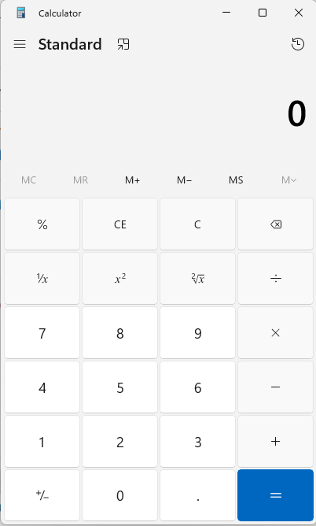

# Installing the Calculator

> [!NOTE]
> This guide explains how to install the calculator on Windows.

## Steps to Install

1. Download the installer from [official website](https://www.linkedin.com/in/sagar-dubewar-a1b03554/).
2. Run the setup and follow the on-screen instructions.
3. Verify the installation by running:
   ```sh
   calculator.exe --version
4. Once the installation is complete and you launch it, you should see the following confirmation screen: 
   
   